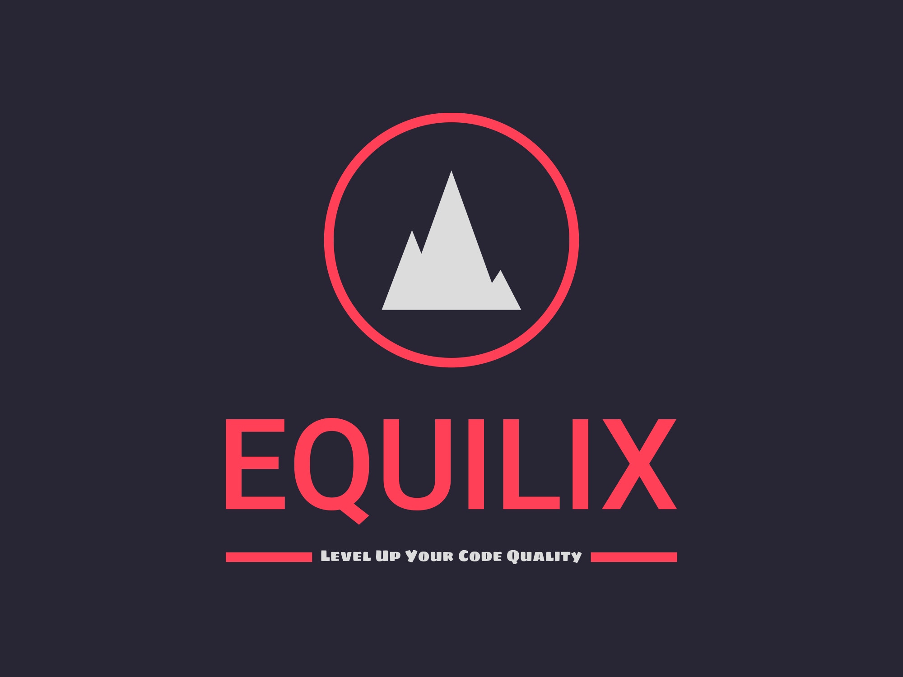

  

# Equilix - VS Code Extension

Congratulations on creating your Equilix extension for Visual Studio Code! This extension enhances the editing experience by automatically converting variables from `var` to `let` or `const`, and equality/inequality operators from `==` to `===` and `!=` to `!==` on save.

## Features

- Automatic conversion of `var` to `let` or `const` for variable declarations.
- Conversion of equality (`==`) and inequality (`!=`) operators to strict equality (`===`) and strict inequality (`!==`).
- Real-time feedback with an on-save popup notification indicating the successful conversion.

## Requirements

- Visual Studio Code version 1.56.0 or above.

## Installation

1. Launch Visual Studio Code.
2. Go to the Extensions view (Ctrl+Shift+X).
3. Search for "Equilix" and click Install.
4. Reload Visual Studio Code to activate the extension.

## Usage

1. Open a JavaScript file (.js) in Visual Studio Code.
2. As you save the file, Equilix will automatically convert `var` to `let` or `const`, and `==` to `===` and `!=` to `!==`.
3. If any conversions are made, a success notification popup will be displayed.

## Configuration

Equilix does not require any additional configuration. It works out of the box with the default settings.

## Feedback and Contributions

- If you encounter any issues or have suggestions, please [open an issue](https://github.com/your-username/your-extension-repo/issues).
- Contributions are welcome! Feel free to [fork the repository](https://github.com/your-username/your-extension-repo/fork) and submit a pull request.

## License

This extension is licensed under the [MIT License](LICENSE).

---

Thank you for using Equilix! If you find it helpful, don't forget to leave a ⭐️ on the [GitHub repository](https://github.com/your-username/your-extension-repo). If you have any questions or need further assistance, please don't hesitate to reach out.

Happy coding!
