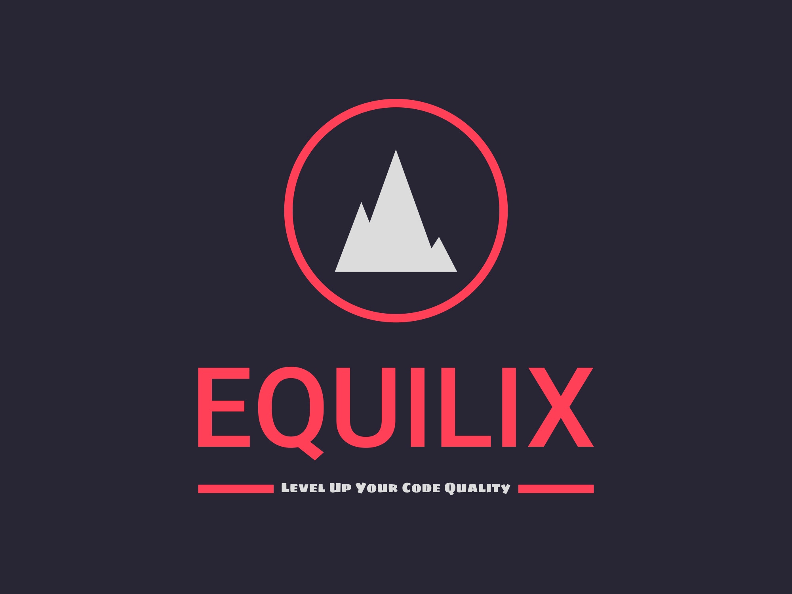

  

# 🌟 Equilix - VS Code Extension

Equilix extension for Visual Studio Code! This extension enhances the editing experience by automatically equality/inequality operators from `==` to `===` and `!=` to `!==` on save.

## ✨ Features

- Conversion of equality (`==`) and inequality (`!=`) operators to strict equality (`===`) and strict inequality (`!==`).
- Real-time feedback with an on-save popup notification indicating the successful conversion.

## Eliminates Manual ESLint Setup:

- With Equilix, there's no need to manually run ESLint with the --fix flag modify package.json scripts. Equilix seamlessly integrates into Visual Studio Code and automatically applies the necessary code transformations on save. This eliminates the extra steps of running ESLint separately and simplifies the development workflow.
  By using Equilix, you can avoid the hassle of configuring and running ESLint with --fix, setting up scripts in package.json, and ensuring consistent execution across different environments. Equilix provides a more straightforward and streamlined approach to code transformations, making the process quicker and more convenient.

❗️ Note

While Equilix offers a simplified alternative for specific code transformations, it's important to recognize that ESLint remains a robust tool for code linting, offering extensive rule sets, customizability, and integration with various development environments. Depending on your project's complexity and specific requirements, ESLint might be the preferred choice to enforce a wider range of coding standards.

## ⚙️ Tech Stack

- Equilix is built using the following technologies:

- JavaScript and TypeScript: The core functionality and extension API are implemented using JavaScript and TypeScript, providing a robust and efficient codebase.

- Visual Studio Code Extension API: Equilix leverages the powerful Visual Studio Code Extension API to integrate seamlessly into the editor, allowing automatic code transformations on save.

- Regular Expressions: The conversion logic relies on regular expressions to identify and replace var, ==, and != occurrences, ensuring accurate and efficient transformations.

## 📋 Requirements

- Visual Studio Code version 1.56.0 or above.

## 🚀 Installation

1. Launch Visual Studio Code.
2. Go to the Extensions view (Ctrl+Shift+X).
3. Search for "Equilix" and click Install.
4. Reload Visual Studio Code to activate the extension.

## 🎯 Usage

1. Open a JavaScript file (.js) in Visual Studio Code.
2. As you save the file, Equilix will automatically convert and `==` to `===` and `!=` to `!==`.
3. If any conversions are made, a success notification popup will be displayed will the line number where that conversion happened

## 🎯Usage(if above method does not work)

1. Open a JavaScript file (.js) in Visual Studio Code.
2. If On save it does not automarically convert them open command pallete `(cntrl+shift+p)` and type equilix
3. Press `enter` and you will see a error stating that `wrong command` press `ok`
4. Now again on save , your extension should be enable

## ⚙️ Configuration

Equilix does not require any additional configuration. It works out of the box with the default settings.

## 💌 Feedback and Contributions

- If you encounter any issues or have suggestions, please [open an issue](https://github.com/Akshat2Jain/Equilix/issues).
- Contributions are welcome! Feel free to and submit a pull request.

## 📄 License

This extension is licensed under the [MIT License](LICENSE).

---

Thank you for using Equilix! If you find it helpful, don't forget to leave a ⭐️ on the [GitHub repository](https://github.com/Akshat2Jain/Equilix). If you have any questions or need further assistance, please don't hesitate to reach out.

# 🛠️ Contributing

Thank you for your interest in contributing to Equilix! We appreciate your help in making our project even better. Here's a step-by-step guide to get you started:

### Fork the Equilix repository

Start by forking the Equilix repository to your GitHub account. This will create a copy of the repository under your account.

### Clone your forked repository

Clone the forked repository to your local machine using Git. This will download a copy of the repository to your computer.

`git clone https://github.com/your-username/Equilix.git`

### Set up the development environment

Navigate to the cloned repository directory and set up the development environment by running the following command:

`npm install`

This command will install all the necessary dependencies and tools required for development.

### Make the necessary changes and enhancements

Now you're ready to start making changes! Use your favorite code editor to make the necessary modifications and enhancements to the project. Feel free to explore the codebase, add new features, fix bugs, or improve the documentation.

### Debug your changes

To debug your changes, use the `F5` key in your code editor. This will compile and run the extension in a new Extension Development Host window. You can then test your changes and ensure they are working as expected.

### Create a Pull Request

Once you're satisfied with your changes, it's time to share them with us. Commit your changes locally, push them to your forked repository on GitHub, and then create a Pull Request (PR) from your forked repository to the main Equilix repository. Make sure to provide a clear and descriptive title for your PR and explain the changes you've made. We will review your contribution and provide feedback if necessary.

That's it! By following these steps, you'll be able to contribute to Equilix and make a positive impact on the project. We greatly appreciate your support and look forward to reviewing your contributions. Happy coding!

Happy coding! ✨🚀
